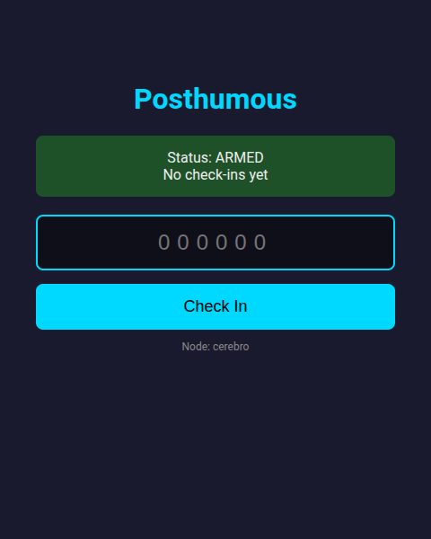
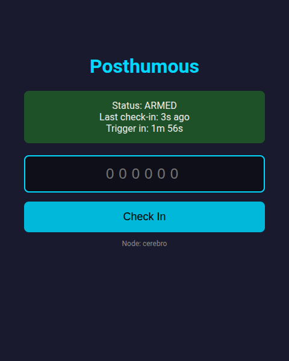
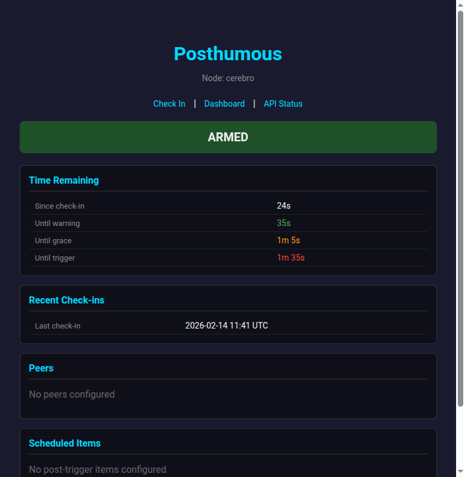
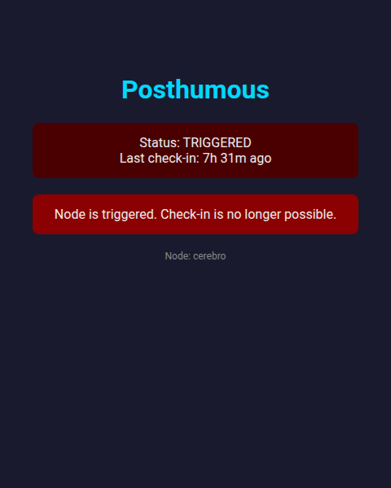
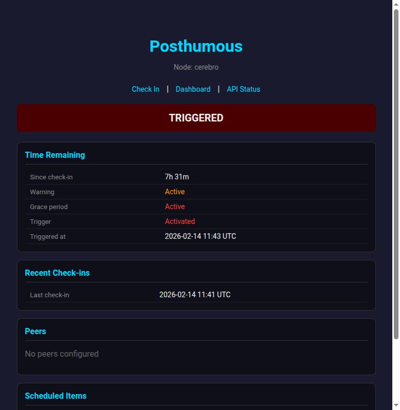

Some things should only happen after you can't do them yourself.

Posthumous is a self-hosted dead man's switch. You check in periodically — via a phone, a browser, the CLI, or an API call — and if you stop, it progresses through escalating stages before triggering automated actions: sending notifications, running scripts, or anything you've configured.

I built it because the existing options are either cloud-hosted (you're trusting someone else's uptime for your most important automation) or single-node (one server failure and silence is indistinguishable from death). Posthumous is federated — multiple nodes watch each other — and fully self-hosted.

This post walks through the basic workflows with screenshots.

<!--more-->

---

## Setup

Installation is a single pip command:

```bash
pip install posthumous
```

Initialization generates a TOTP secret and creates the config directory:

```bash
$ phm init --node-name cerebro
Generated new TOTP secret.
Config created at ~/.posthumous/config.yaml
Example script created at ~/.posthumous/scripts/example.sh

==================================================
TOTP Setup - Scan with your authenticator app:
==================================================

[QR code appears here]

Manual entry URI: otpauth://totp/Posthumous:cerebro?secret=...&issuer=Posthumous
Secret: JBSWY3DPEHPK3PXP

==================================================
IMPORTANT: Save this secret securely!
==================================================
```

You scan the QR code with any authenticator app — Google Authenticator, Authy, 1Password, whatever generates TOTP codes. That same code is how you prove you're alive.

The config file (`~/.posthumous/config.yaml`) controls timing, notifications, and actions:

```yaml
node_name: cerebro
secret_key: JBSWY3DPEHPK3PXP
listen: "0.0.0.0:8420"
base_url: "https://posthumous.example.com:8420"
checkin_interval: 7 days
warning_start: 8 days
grace_start: 12 days
trigger_at: 14 days
notifications:
  default:
    - ntfy://my-posthumous-channel
actions:
  on_warning:
    - notify: default
      message: "Check-in needed. {days_left} days remaining.\n\nCheck in: {checkin_url}"
  on_grace:
    - notify: default
      message: "URGENT: Posthumous triggers in {hours_left} hours.\n\nCheck in: {checkin_url}"
  on_trigger:
    - notify: default
      message: "Posthumous has activated.\n\nDashboard: {dashboard_url}"
    - script: scripts/release-credentials.sh
```

Notification messages support template variables like `{checkin_url}` and `{dashboard_url}` — so push notifications to your phone include a direct link back to the check-in page. No need to remember a URL.

---

## The Check-in Flow

Start the daemon:

```bash
$ phm run
Starting Posthumous node 'cerebro'...
```

This launches the web server, watchdog timer, and scheduler. Navigate to the check-in page:



The UI is intentionally minimal — dark theme, big input, works on a phone screen. Enter your 6-digit TOTP code from your authenticator app and hit Check In.

After a successful check-in, the timer resets and you can see the countdown:



The status line tells you exactly how long until the system would escalate. In production you'd have days or weeks, not seconds.

You can also check in via the CLI or the JSON API:

```bash
# CLI check-in (prompts for TOTP)
$ phm checkin
TOTP code: 645557
Check-in accepted
  Status: ARMED
  Next deadline: 2026-02-28 11:41 UTC

# API check-in (for automation)
$ curl -X POST http://localhost:8420/checkin \
    -H 'Content-Type: application/json' \
    -d '{"totp": "645557"}'
{"success": true, "status": "armed", "next_deadline": "2026-02-28T11:41:43+00:00"}
```

---

## The Dashboard

The dashboard shows everything at a glance — countdown timers, check-in history, peer status, and scheduled post-trigger actions:



The color coding matches the urgency: green for "Until warning" (you're fine), orange for "Until grace" (getting close), red for "Until trigger" (last chance). The dashboard auto-refreshes every 60 seconds.

---

## The State Machine

Posthumous progresses through four states:

```
ARMED ──timeout──> WARNING ──timeout──> GRACE ──timeout──> TRIGGERED
  ^                   |                   |                    |
  └─── check-in ──────┴─── check-in ─────┘                    v
                                                    (scheduler runs forever)
```

A check-in from any pre-trigger state resets to ARMED. **TRIGGERED is terminal** — once activated, no check-in can undo it. This is by design: if the switch has fired, you want the actions to complete.

Each transition fires its configured actions. If the node was offline and missed intermediate states (say it was down during WARNING and comes back during GRACE), the watchdog fires all skipped callbacks in order before reaching the current state. No notifications are silently dropped.

When the system reaches TRIGGERED, the check-in page locks out:



And the dashboard reflects the terminal state:



---

## Notifications

Posthumous uses [Apprise](https://github.com/caronc/apprise) for notifications, which means it supports 100+ notification services out of the box: ntfy, Pushover, Telegram, Discord, email, Slack, and many more.

```yaml
notifications:
  default:
    - ntfy://my-posthumous-channel
  urgent:
    - pover://user@token
    - tgram://bot_token/chat_id
```

Each escalation stage can target different channels with different messages. Warning might go to ntfy (a gentle ping), while grace and trigger go to Pushover and Telegram (hard to miss).

The new `{checkin_url}` variable means warning notifications include a clickable link directly to the check-in page — open the notification on your phone, tap the link, enter the TOTP code. Three taps and you're checked in.

---

## Federation

A single node has a single point of failure. If the server goes down, silence looks the same as death — which means either false triggers or missed real triggers.

Posthumous solves this with federation. Multiple nodes share the same TOTP secret and communicate via HMAC-signed HTTP:

```yaml
# Node A's config
peers:
  - https://node-b.example.com:8420
  - https://node-c.example.com:8420
```

When you check in to any node, it broadcasts to all peers. When any node triggers, it broadcasts that too. The design bias is deliberate: **duplicates over silence**. Multiple nodes may fire the same notification — annoying but survivable. A missed trigger is not.

Each node tracks peer health independently, and the dashboard shows peer status with connection age and failure counts.

---

## Post-Trigger Scheduling

Once triggered, Posthumous doesn't just fire-and-forget. A scheduler runs forever, executing actions on configurable schedules using a small DSL:

```yaml
post_trigger:
  - name: weekly-reminder
    when: every week after trigger
    notify: default
    message: "Posthumous was triggered {days_left} days ago."

  - name: credential-release
    when: 30 days after trigger
    script: scripts/release-credentials.sh

  - name: annual-memorial
    when: every year on trigger anniversary
    notify: default
    message: "Annual memorial notification."
```

The `when` expressions support relative timing (`30 days after trigger`), recurring patterns (`every week after trigger`), anniversaries (`every year on trigger anniversary`), and absolute dates. Each execution is deduplicated by period key — if a node restarts, it won't re-run actions for the current period.

---

## Security

Authentication uses TOTP (the same protocol as Google Authenticator). This means:

- **No passwords stored on the server** — only the shared secret
- **Time-based codes expire every 30 seconds** — replay attacks have a narrow window
- **Brute-force protection** — after configurable failed attempts, the account locks out for a configurable duration

The check-in page properly locks out after too many failures, and the API returns HTTP 429.

Peer communication is authenticated with HMAC-SHA256 signatures derived from the shared secret. State files can optionally be encrypted at rest with Fernet (AES-128-CBC), enabled with a single config flag:

```yaml
encrypt_at_rest: true
```

---

## Status at a Glance

```bash
$ phm status
Node: cerebro
Status: ARMED
Last check-in: 2026-02-14 11:41 UTC

Warning in:  6d 23h
Grace in:    10d 23h
Trigger in:  12d 23h
```

Or hit the JSON API for monitoring integrations:

```bash
$ curl -s http://localhost:8420/status | python -m json.tool
{
    "node_name": "cerebro",
    "status": "armed",
    "last_checkin": "2026-02-14T11:41:43+00:00",
    "time_remaining": {
        "until_warning": 596503.0,
        "until_grace": 942103.0,
        "until_trigger": 1114903.0
    }
}
```

---

## What's Next

Posthumous is at v0.5. The core workflows are solid — check-in, state machine, notifications, federation, scheduling, encryption at rest. Some things I'm considering:

- **Static site integration** — generating a Hugo/Jekyll site from post-trigger content, hosted on GitHub Pages
- **Multi-factor escalation** — requiring check-ins from multiple sources (web + CLI + API) before considering you "alive"
- **Better peer discovery** — automatic peer registration instead of manual URL configuration

The code is on GitHub: [queelius/posthumous](https://github.com/queelius/posthumous). It's a single `pip install` and about 2,200 lines of Python (plus 3,700 lines of tests at 99% coverage).

---

*Posthumous is named for the obvious reason. Some automations only make sense after the fact.*
